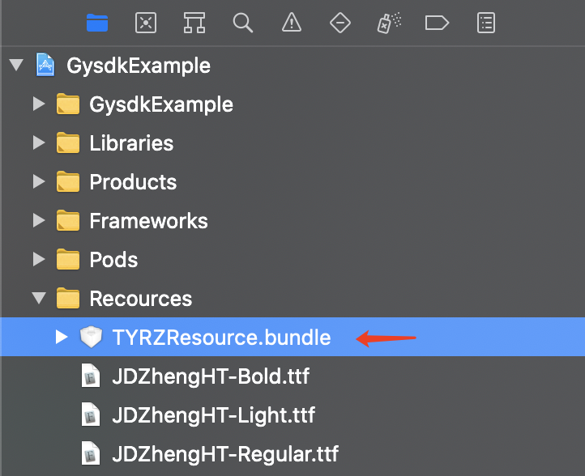
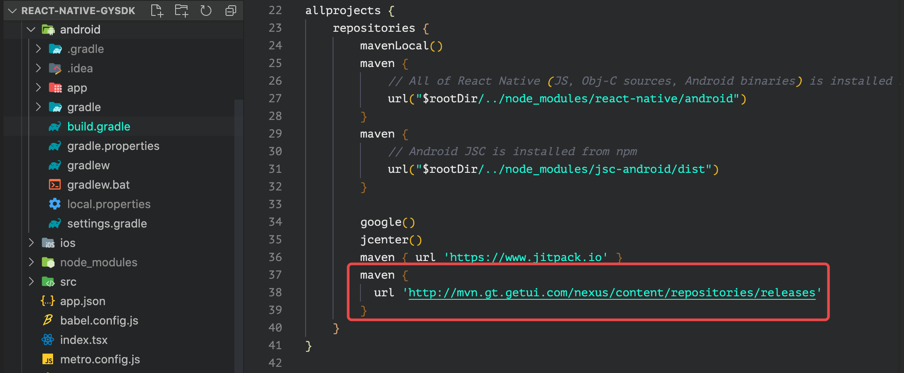
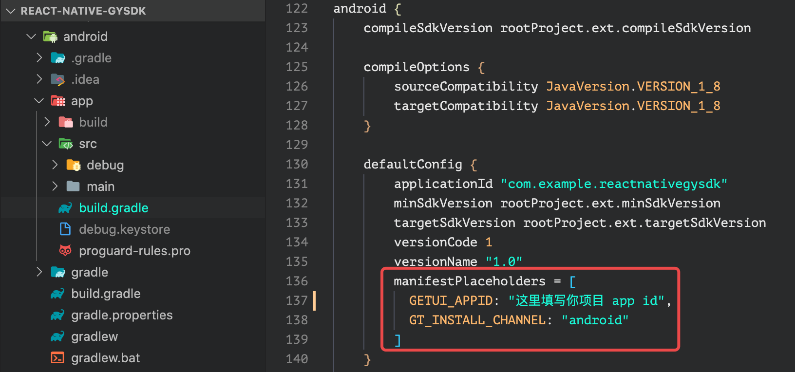

# react-native-gysdk

个验 React Native SDK

## 声明

**本 SDK 处于初期开发阶段，API 可能会有大幅改动！特此声明！**

## 安装

```sh
npm install @kangfenmao/react-native-gysdk
cd ios && pod install && cd ..
```

## 集成

**iOS 集成**

将 TYRZResource.bundle 添加到项目中，根据项目需求替换里面的文件



**Android 集成**

1. 在项目根目录 build.gradle -> allprojects -> repositories 下面增加个验 maven 仓库

```gradle
maven {
  url 'https://mvn.getui.com/nexus/content/repositories/releases'
}
```


2. 在项目APP模块目录 build -> gradle -> android -> defaultConfig 增加配置

```gradle
manifestPlaceholders = [
  GETUI_APPID: "你的个验 APP ID",
  GT_INSTALL_CHANNEL: "android"
]
```




## 使用方法

请参看 [example](example/src/App.tsx)

```js
import Gysdk from 'react-native-gysdk'

const init = async () => {
  const initResult = await Gysdk.init('APP_ID')
  console.log(initResult)
}

const debug = () => Gysdk.debug(true)

const check = async () => {
  // 检测超时时间(s)
  const token = await Gysdk.check({ timeout: 3 })
  console.log(token)
}

const login = async () => {
  const loginResult = await Gysdk.login({
    authButtonTitle: '本机号码一键登录',
    switchButtonText: '其他方式登录'
  })

  console.log(loginResult)
}
```

## 数据示例

init

```js
{
  success: true
  code: 200
  message: "初始化成功"
}
```

check

```js
{
  success: true
  code: 30000
  gyuid: "412c1a6cd17f4547922788bc9a5577d636"
  processID: "b56af2a8802a00e04430854b6f753796"
  operatorType: "CT"
  msg: "0"
}
```

login

```js
{
  success: false
  code: 30006
  errorCode: "-20303"
  gyuid: "412c1a6cd17f4547922788bc9a5577d636"
  operatorType: "CT"
  msg: "点击切换账号"
  metadata: "{"error_data":"点击切换账号"}"
}
```

```js
{
  success: true
  code: 30000
  gyuid: "412c1a6cd17f4547922788bc9a5577d636"
  token: "bm1lY2FlOTk4NjQwMTQ0MTJmOWY5ZjAzNGI2NTc3OTE3Y3w1MDQyfDN8djJ8Mw=="
  expiredTime: 1619246213687
}
```

## 官方文档

Gysdk 基于官方 SDK 封装，使用之前请认真阅读官方文档：

[Android 接入文档](https://docs.getui.com/geyan/mobile/android/init/)  
[iOS 接入文档](https://docs.getui.com/geyan/mobile/ios/init/)

## 常见错误

如果 init 过程中出现错误，请检查 appId 是否配置错误，同时还需要检查[应用是否审核通过](应用是否审核通过)

[Android 状态码汇总](https://docs.getui.com/geyan/mobile/android/code/)
[iOS 状态码汇总](https://docs.getui.com/geyan/mobile/ios/code/)

## Contributing

See the [contributing guide](CONTRIBUTING.md) to learn how to contribute to the repository and the development workflow.

## License

MIT
